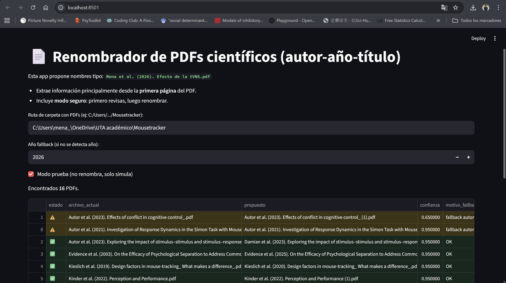

# Renombrador de PDFs científicos

## 📘 Leer esta documentación en [English](README.md)

Una **aplicación local ligera en Streamlit** para renombrar automáticamente archivos PDF científicos usando el formato:

> **PrimerAutor et al. (Año). Título.pdf**

La aplicación extrae metadatos directamente desde la **primera página del PDF** (título, autores, año) y propone nombres de archivo estandarizados.  
Incluye un **modo de previsualización seguro**, que permite revisar los cambios antes de renombrar los archivos.

### Interfaz principal


---

## ✨ Funcionalidades

- Extracción automática de:
  - Primer autor
  - Año de publicación
  - Título del artículo
- Heurísticas robustas para distintos formatos de revistas
- **Modo de previsualización** seguro (no se renombra ningún archivo hasta confirmarlo)
- Indicadores visuales:
  - ✅ Alta confianza
  - ⚠️ Fallback o baja confianza
- Funciona **completamente de forma local** (no se suben archivos a ningún servidor)

---

## 🖥️ Requisitos

- **Python 3.10 o 3.11**  
  Descargar desde: https://www.python.org  
  ⚠️ Asegúrate de marcar **“Add Python to PATH”** durante la instalación.

- Windows (probado en Windows 10/11)

---

## 🚀 Cómo ejecutar la aplicación (modo fácil)


1. Descarga o clona este repositorio
2. Haz doble clic en el archivo:

    ```text
    run_app.bat
    ```

3. El navegador se abrirá automáticamente en:
    ```text
    http://localhost:8501
    ```

4. Pega la ruta de la carpeta que contiene tus archivos PDF
5. Usa primero el modo de previsualización y luego renombra los archivos

---

## 🧪 Flujo de trabajo recomendado

1. Activar el modo de previsualización
2. Revisar los nombres propuestos
3. Prestar atención a las filas marcadas con ⚠️
4. Desactivar el modo de previsualización
5. Renombrar los archivos
6. Corregir manualmente solo los casos restantes

Este enfoque suele automatizar entre el **70% y el 90%** del trabajo de renombrado.

---

## ⚠️ Notas y solución de problemas

- Si la página aparece en blanco:
  - Abre la app en modo incógnito
  - O desactiva temporalmente bloqueadores de anuncios / extensiones de privacidad

- Si usas OneDrive:
  - Pausar la sincronización puede evitar problemas de bloqueo de archivos

- La aplicación **nunca modifica archivos** a menos que se confirme explícitamente

---

## 📁 Estructura del proyecto

```text
pdf_renamer_app/
│
├─ app.py
├─ requirements.txt
├─ run_app.bat
└─ README.md
```

## 🧠 Limitaciones

- La extracción de metadatos desde PDFs se basa en heurísticas

- Algunos formatos de revistas o convenciones de nombres de autores pueden requerir corrección manual

- Diseñada como una herramienta de productividad, no como un parser bibliográfico completo